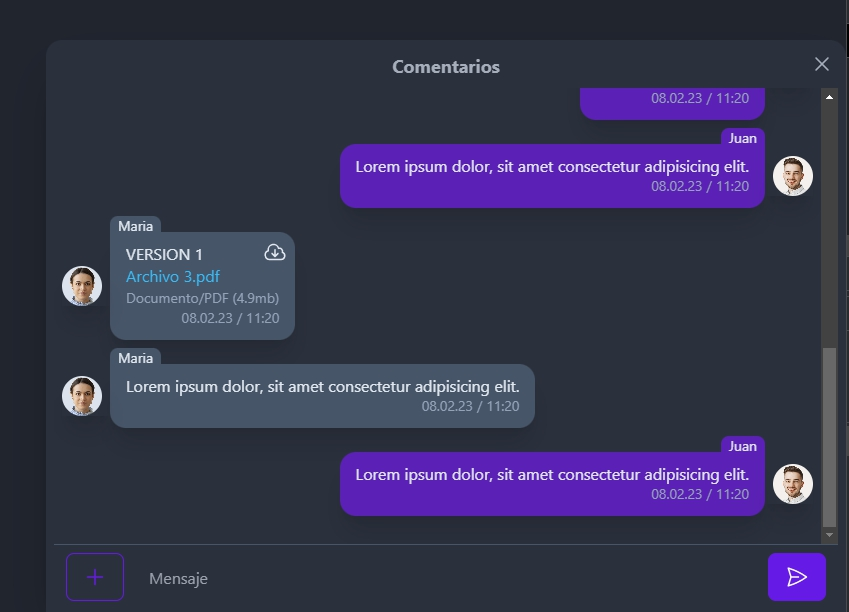
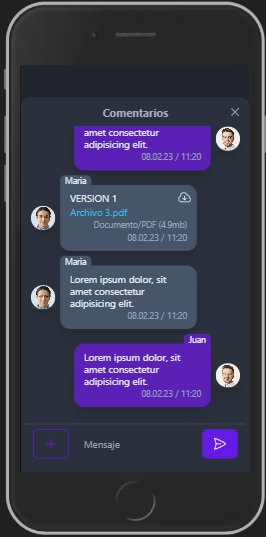

# Chat 📝  

Ejemplo de desarrollo de chat

### Libraries

- Vue 3 Composition API
- Vite
- Pinia
- TailwindCSS
- daisyUI
- axios

## Screenshots
  
  


## Project Setup 🚀

```sh
npm install
```

### Compile and Hot-Reload for Development

```sh
npm run dev
```

### Compile and Minify for Production

```sh
npm run build
```
 

